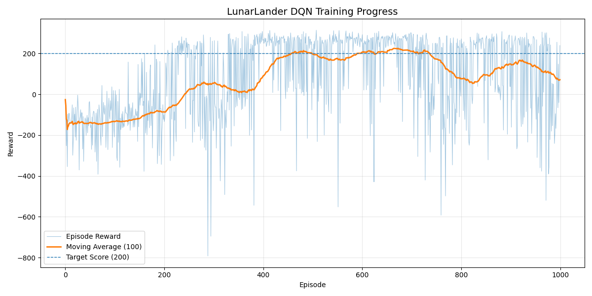
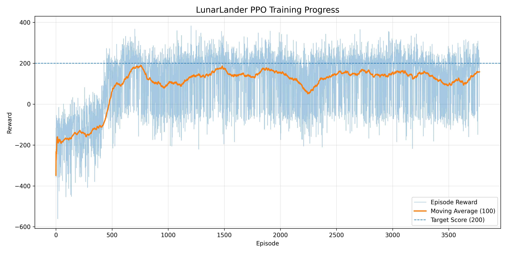

# LunarLander Reinforcement Learning (DQN & PPO)

This repository contains **from-scratch implementations** of two classic reinforcement learning algorithms  
applied to **OpenAI Gymnasium – LunarLander-v3**:

- **DQN (Deep Q-Network)** — off-policy, value-based
- **PPO (Proximal Policy Optimization)** — on-policy, policy-gradient

The goal is not to use high-level RL libraries, but to **understand and implement the core algorithms manually**.

---

### 1️⃣ DQN (Deep Q-Network)

**Characteristics**
- Off-policy
- Value-based
- Uses replay buffer
- ε-greedy exploration
- Q-learning target update

**Training style**
- Episode-based
- Each episode → multiple gradient steps using replay buffer

**Typical properties**
- Faster initial learning
- Less stable in continuous or high-variance settings
- Sensitive to hyperparameters

---

### 2️⃣ PPO (Proximal Policy Optimization)

**Characteristics**
- On-policy
- Actor–Critic architecture
- Clipped surrogate objective
- Generalized Advantage Estimation (GAE)
- Entropy bonus for exploration

**Training style**
- **Step-based rollout** (default: 2048 steps)
- One rollout may contain **multiple episodes**
- Policy updated for multiple epochs per rollout

**Important note**
> PPO is **not episode-based**.  
> Episode rewards are used **only for logging and evaluation**,  
> not as the training unit.

---

## Key Conceptual Differences

| Aspect | DQN | PPO |
|-----|----|----|
| Policy type | Implicit (via Q) | Explicit stochastic policy |
| On / Off policy | Off-policy | On-policy |
| Training unit | Episode / Replay batch | Fixed steps (rollout) |
| Stability | Medium | High |
| Reward variance | Lower | Higher (by design) |
| Deterministic | Mostly | Stochastic |

---
## 📊 Training Curve

---

##  Environment

- **Gymnasium**: `LunarLander-v3`
- Discrete action space
- Observation space: 8-dimensional continuous vector

